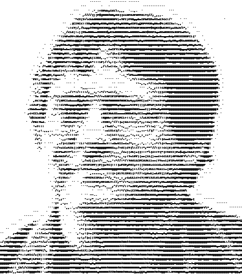

# netpbm-asciiart
Copyright (c) 1990 Bart Massey

<table align="center" style="width: 70%">
<caption style="font-size: 70%; text-align: left; caption-side: bottom">
  <i>Left: </i>Sample 132-column <tt>mkasciiart</tt> output;
  <i>Right: </i>Result of recycling this ASCII art
     through <tt>asciiartopgm</tt></i>
</caption>
<tr>
<td>

</td>
<td>

</td>
</tr>
</table>

These programs convert between ASCII art and PNM the netpbm
way, with decent quality in each direction.  (My
asciiarttopgm, BTW, is *way* better than the asciitopgm
currently in Netpbm of any stripe.) This suite consists of
programs to convert ASCII art to PBM and PGM format
(<tt>asciiarttopbm</tt>, <tt>asciiarttopgm</tt>), and a
program to convert PGM to ASCII art
(<tt>pgmtoasciiart</tt>), along with a helper script for the
latter (<tt>mkasciiart</tt>).

For usage information, please see the included manual pages.

## History

These are really really old programs.  It turns out, after
some investigation, that I seem to have wrote them :-). I
kind of think I might have written <tt>pgmtoasciiart.c</tt>
at UO in the early 1990s. The suite has been continuously
maintained and improved since then.

## Building

A development install of Netpbm
(http://netpbm.sourceforge.net) is necessary to build this
stuff. It will build and run with the Debian
`libnetpbm11-dev` currently in `experimental`: this is
currently preferred.  It will build and run with the
Sourceforge netpbm: see the `Makefile`.  It will probably
build and run with the Debian `libnetpbm10-dev`: see the
`Makefile`.

The included `glyphshades` utility can produce or reproduce
shade files for font density information. Rebuilding
`glyphshades` requires a development install of
[Cairo](http://cairographics.org) (Debian package
`libcairo-dev`). This is not necessary to build the other
tools, which will otherwise use glyph shade files checked
into the repo.

This stuff represents a crazy amount of tweaking. Have fun
doing more if you like.

## License

This work is licensed under the "MIT License". Please see
the file `COPYING` in this distribution for license terms.
